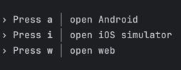

# Welcome to SmartSign – Secure Mobile Document Signing with Smart-ID!

SmartSign is a mobile application for Android and iOS that enables users to securely sign documents using Smart-ID authentication. Built with a Kotlin Spring backend, the app manages user data and document workflows, communicating with a PostgreSQL database via JOOQ. Users can upload documents, send them to others for signing, and even initiate group signings with a defined signing order — all from their phones.

Read the following instructions, to get to know how to run it.

## How to run this application? Pre-conditions.
You can download the Expo GO app on your phone, but the project works best running locally through the Expo web application or mobile simulator.

[Android devices](https://play.google.com/store/apps/details?id=host.exp.exponent&hl=en&pli=1) & [iOS devices](https://apps.apple.com/us/app/expo-go/id982107779).

**You have to download** the Smart-ID demo application, in order to access the app. This requires registration with an "isikukood" and ID-document. 

[Find more info here.](https://www.smart-id.com/wordpress/wp-content/uploads/2022/08/smart-id_rgb_v1-1.pdf)

[iOS testflight app link.](https://testflight.apple.com/join/DoWddZjR)

Only after this has been done, you authenticate and sign with our application.

## How to run our application?
Change the IP addresses in the "Frontend/data.ts" and "Backend/src/main/kotlin/com/d4b/sid/Config.kt" to match your ip addresses.
See the files for an example. Usually (If you run the app with expo in web) 127.0.0.1 should be sufficient. If not, find out your address online.

Make sure you have "npm" installed.
Have the two directories opened in separate tabs.

### Frontend:
``` 
cd .\Frontend\ 
```
```
npm install
```
```
npx expo start
```

It's easiest to run the application with Expo through the web application or by using one of the simulators.
When you run "npx expo start" you get the prompts to choose between a simulator.
(For running in web type "w" into the console etc.)


---
**P.S.** If your computer gives you an error saying "too many files", please download and run "watchman". After installing, just write "watchman" in the same Frontend directory.
For macOS, install it with Homebrew using "brew install watchman"

**P.S.** You need to configure your application.properties file before running backend!
**P.S.** You need to launch you database before running backend!

### application.properties:
You have to change the project.directory.path variable in
application.properties to the path of your project e.g.
C:\\Users\\user\\folder\\digidoc4business (windows)

### Developer Mode:
Developer mode displays buttons to sign in without Smart-ID verification under test user alias. This means that signing functionality is disabled in that case.
To enable or disable developer mode, simply update the value of `developerMode` in the data.ts file.

### Database:
You should have docker in your computer.
If you want to run the app with the PostgreSQL database then run before running ./gradlew bootRun:
``` 
cd .\Backend\ 
```
```
docker compose up
```
If you want to save changes made to the database then run
```
docker exec -t digidocContainer pg_dump -U postgres --encoding=UTF8 digidoc4business > src/main/resources/db/digidoc4business_dump_latest.sql
```
If you want to remove the database completely from your docker run:
```
docker compose down -v
```

### Backend:
```
cd .\Backend\
```
```
./gradlew build
```
```
./gradlew bootRun
```
